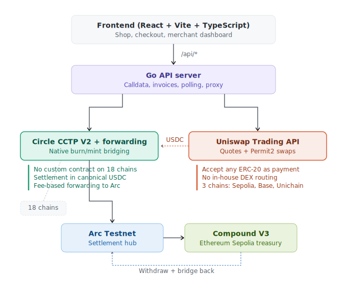
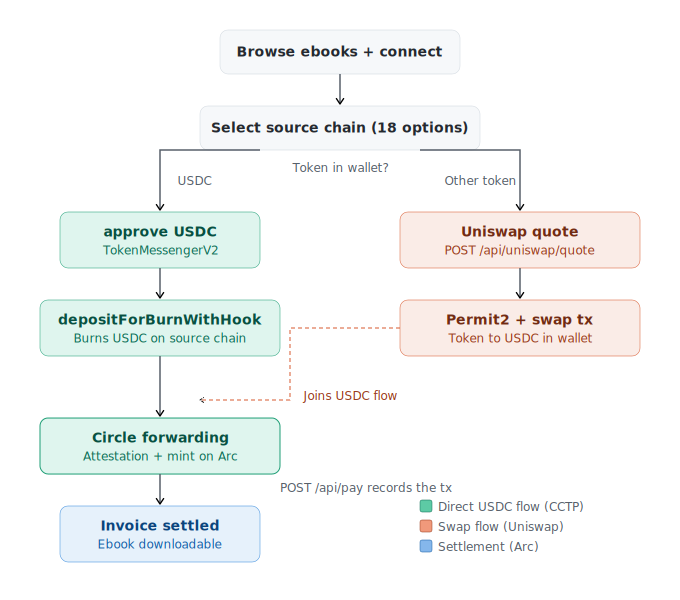
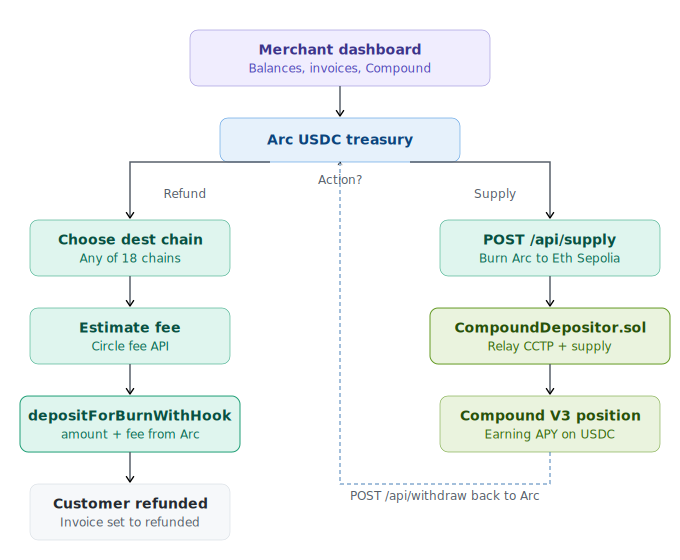

# Merx

Chain-abstracted ebook shop built on Circle CCTP V2 and Arc. Customers pay with USDC from 18 chains — or swap from any token via Uniswap. Everything settles on Arc in under a second. The merchant can refund to any chain and earn yield on idle USDC through Compound V3.

No custom contracts deployed on source chains — Circle's CCTP V2 Forwarding Service handles all bridging.

## Architecture

### System overview

<p align="center">
  
</p>

| Component | Role |
|-----------|------|
| **CCTP V2 Forwarding Service** | Burns USDC on source, mints on Arc. No custom contracts per chain, no relayer infra. |
| **Arc** | Settlement hub. Sub-second deterministic finality, no reorgs. Gas paid in USDC. |
| **Uniswap Trading API** | Swap any token to USDC before bridging (Ethereum, Base, Unichain Sepolia). |
| **Compound V3** | Yield on idle USDC. Supply/withdraw via CompoundDepositor on Ethereum Sepolia. |

### Customer checkout

<p align="center">
  
</p>

**Direct USDC:** approve TokenMessengerV2 → `depositForBurnWithHook` → Forwarding Service mints on Arc.

**Swap flow:** Uniswap quote → Permit2 approve → swap → then same CCTP bridge to Arc.

### Merchant operations

<p align="center">
  
</p>

**Refund:** `depositForBurnWithHook` from Arc → Forwarding Service delivers to customer's chain. Fee estimated via CCTP fee API, merchant sends `amount + fee` so customer gets the exact amount.

**Supply to Compound:** CCTP bridge Arc → Ethereum Sepolia → CompoundDepositor relays mint + supplies in one tx.

**Withdraw:** Compound withdraw → approve → CCTP bridge back to Arc.

## Project structure

```
cmd/server/              Go API server (CCTP flows, invoices, refunds, treasury, Uniswap proxy)
frontend/src/            React + Vite + TypeScript (shop, checkout, merchant dashboard)
contracts/src/           CompoundDepositor.sol (CCTP relay + Compound V3 supply)
uniswap-api/             Uniswap Trading API client
ebooks/                  PDF assets served after purchase
registry.yaml            Chain/token/RPC/explorer registry (18 chains)
params.go                Protocol addresses, Arc config, deployed contracts
```

## Quick start

```bash
# Backend
PRIVATE_KEY=0x... go run ./cmd/server

# Frontend
cd frontend && npm install && npm run dev
```

Shop: http://localhost:5173 — Dashboard: http://localhost:5173/dashboard

## API

| Method | Endpoint | Description |
|--------|----------|-------------|
| GET | `/api/config` | Merchant address |
| GET | `/api/chains` | Chain/token registry |
| GET | `/api/pay-tx` | Build `depositForBurnWithHook` calldata + estimated fee |
| POST | `/api/pay` | Record payment, start settlement tracking |
| GET | `/api/merchant/balances` | Balances + Compound APY |
| POST | `/api/refund` | Refund from Arc to any chain |
| POST | `/api/supply` | Supply USDC to Compound V3 |
| POST | `/api/withdraw` | Withdraw from Compound back to Arc |
| GET | `/api/invoices` | List invoices |
| GET | `/api/ebooks/{invoiceId}` | Download purchased ebook |
| POST | `/api/uniswap/quote` | Swap quote |
| POST | `/api/uniswap/swap` | Build swap tx |

## Supported chains

18 CCTP V2 source testnets: Ethereum Sepolia, Avalanche Fuji, OP Sepolia, Arbitrum Sepolia, Base Sepolia, Polygon Amoy, Unichain Sepolia, Sonic Blaze, Worldchain Sepolia, Sei Atlantic, Linea Sepolia, Codex, Monad, HyperEVM, Ink Sepolia, Plume, EDGE, Morph Hoodi.

Settlement: **Arc Testnet** (chainId 5042002, domain 26).

Uniswap swaps (testnet): Ethereum Sepolia, Base Sepolia, Unichain Sepolia. On mainnet, Uniswap supports 20+ chains — the swap-to-USDC flow would work on all of them.

## Deployed contracts

| Contract | Network | Address |
|----------|---------|---------|
| CompoundDepositor | Ethereum Sepolia | `0x832705f381957C8218d7ae8B20A10d510B5AFB75` |
| TokenMessengerV2 | All testnets | `0x8FE6B999Dc680CcFDD5Bf7EB0974218be2542DAA` |
| MessageTransmitter | All testnets | `0xE737e5cEBEEBa77EFE34D4aa090756590b1CE275` |

No ShopPaymaster — Forwarding Service replaces per-chain contracts.

## Invoice lifecycle

```
paid → bridging → attesting → settled
                                 ↓
                            refunding → refunded
```

## Testing

```bash
go test ./...                              # Go tests
cd contracts && forge test -vvv            # Solidity tests
cd frontend && npm run build               # Frontend build
```

## Tech stack

| Layer | Tech | Why |
|-------|------|-----|
| Frontend | React 19 + Vite + TypeScript | Typed async wallet flows, fast iteration |
| Wallet | wagmi + viem | Multi-chain wallet, typed contract calls |
| Backend | Go 1.25 | Single binary, builds calldata, polls attestations |
| Bridge | Circle CCTP V2 + Forwarding Service | Native burn/mint, no wrapped tokens, no relayer |
| Settlement | Arc Testnet | Sub-second finality, USDC-native gas |
| Swaps | Uniswap Trading API | Pay with any token |
| Yield | Compound V3 | Supply/withdraw idle USDC |
